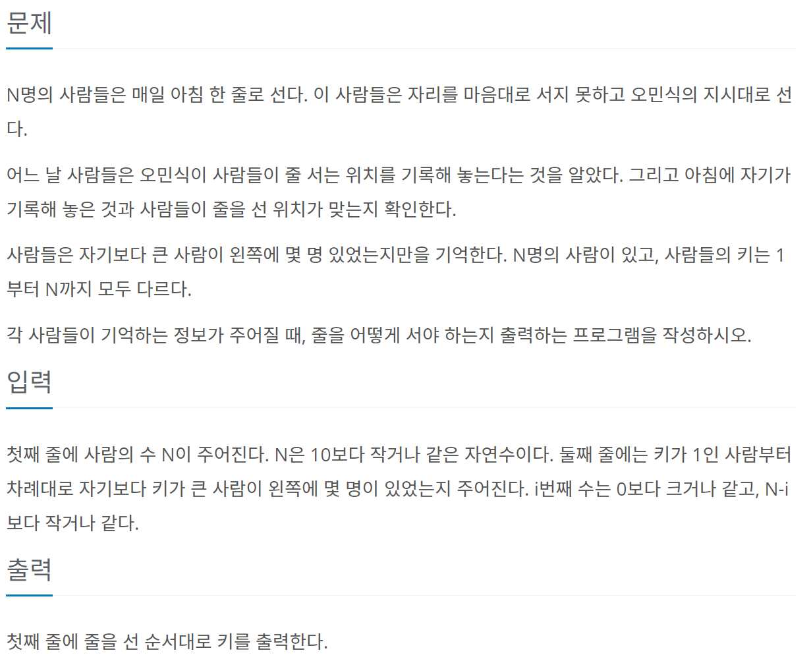

# 한 줄로 서기



https://www.acmicpc.net/problem/1138

## 문제 접근 방법

키가 1인 사람부터 차례때로 자기보다 키가 큰 사람이 왼쪽에 몇 명 있었는지 주어진다.

2 1 1 0 --> 4 2 1 3

4는 0이므로 가장 왼쪽에 존재 (가장 큰 키)

3은 자기보다 큰 키가 4이기 때문에 4의 오른쪽

2는 자기보다 큰 키가 4,3 인데 1명만 있기 때문에 4와 3사이에 넣으면 4,2,3

1은 자기보다 큰 키가 2명이 필요 4,2,1,3

tall[-1] 이 가장 큰 키 이므로 ans 배열의 가장 왼쪽에 존재한다.

자료형 Deque

1. 순서는 배열의 역순으로 한다 (가장 큰 키부터)

2. deque.appendleft() 로 넣는다.

3. 자신보다 큰 사람의 수 > count 이면 count+1 하고 넣을 인덱스를 +1 한다.
4. 자신 보다 큰 사람의 수 = count 이면 스탑하고 해당 인덱스에 삽입한다.

> 해당 문제가 그리디인 이유는 가장 큰 키부터 넣는 것이기 때문이다.

**입력예제**

```python
4
2 1 1 0
```

**출력예제**

`4 2 1 3`

### 코드

```python
from sys import stdin
from collections import deque
stdin = open('input.txt','r')

n = int(stdin.readline())
talls = list(map(int,stdin.readline().split()))
ans = deque()
lenCheck = 0
for i,tallPerson in enumerate(talls[::-1]):
    tall = n-i
    if i == 0: #
        lenCheck+=1
        ans.appendleft(tall)
        continue
    count = 0
    for j in range(lenCheck+1):
        if tallPerson > count:
            count+=1
            continue
        elif tallPerson == count:
            ans.insert(j,tall)
            lenCheck+=1
            break
print(*ans)
```

### Time Complexity

O(n^2)

### 개선 방안

:alarm_clock: 약 1 시간

:heavy_check_mark: 88ms

Deque 말고 range(n-1,-1,-1)로 접근해도 될 것 같다고 생각함

다른 사람의 답은 다음에 보겠음--

